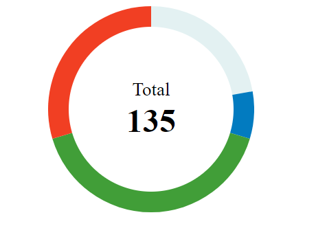
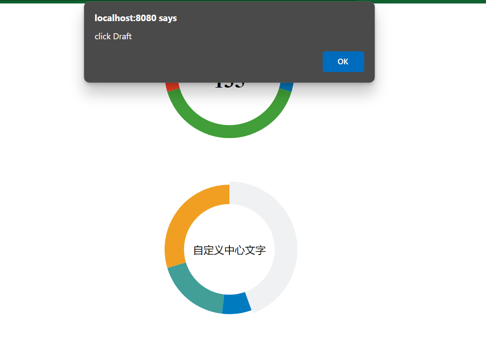

## Pie Chart

### 使用背景

- 使用圆环饼图来显示统计数据
- 不想引入 chart 之类的组件
- 支持自定义颜色,数据字段名称,圆环宽度,点击事件,中心内容

### 基本用法

```
<script setup>
import { ref } from "vue";
import pieChart from "../packages/pieChart.vue";
const chartData1 = ref([
  { label: "Draft", value: 30, color: "#E3F1F2" },
  { label: "In Progress", value: 10, color: "#027BC0" },
  { label: "Approved", value: 55, color: "#419E38" },
  { label: "Rejected", value: 40, color: "#F13F23" },
]);
</script>

<template>
  <div class="testChart">
    <pieChart :chartData="chartData1"/>
    </div>
</template>

<style scoped>
.testChart {
  margin: 0 auto;
  width: 200px;
  height: 200px;
}
</style>
```



### 自定义设置

```
<script setup>
import { ref } from "vue";
import pieChart from "../packages/pieChart.vue";
const chartData = ref([
  { myLabel: "Draft", myValue: 60, myColor: "#EFF1F2" },
  { myLabel: "In Progress", myValue: 10, myColor: "#007BC0" },
  { myLabel: "Approved", myValue: 25, myColor: "#419E98" },
  { myLabel: "Rejected", myValue: 40, myColor: "#F19F23" },
]);
const handleClick = (params) => {
  alert(`click ${params.myLabel}`);
};
</script>

<template>
  <div class="testChart">
    <pieChart
      :chartData="chartData"
      :fieldNames="{ label: 'myLabel', value: 'myValue', color: 'myColor' }"
      ringWitdh="30%"
      :handleClick="handleClick"/>
    </div>
</template>

<style scoped>
.testChart {
  margin: 0 auto;
  width: 200px;
  height: 200px;
}
</style>
```



### API

| name        | type                                                     |
| ----------- | -------------------------------------------------------- |
| chartData   | Array[]                                                  |
| fileNames   | { label: 'myLabel', value: 'myValue', color: 'myColor' } |
| ringWidth   | String (px or %)                                         |
| handleClick | Fuction                                                  |
